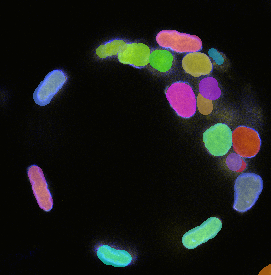
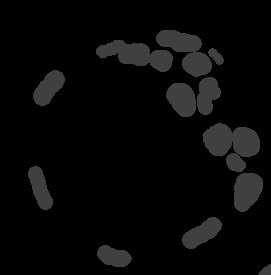
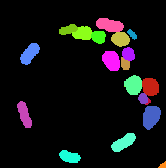

# Label images (OME-NGFF `labels/`)

An OME-Zarr image may carry segmentation masks beside its pixels, in a `labels/` group. Each entry
is a full multiscale image in its own right, whose samples are **object identifiers** rather than
intensities, plus an `image-label` block mapping each value to an RGBA colour.

`ziv serve` renders them.

```sh
ziv serve ./image.ome.zarr
```

| URL | What it renders |
|---|---|
| `/iiif/default/full/max/0/default.jpg` | the intensity image, as always |
| `/iiif/@overlay=nuclei/full/max/0/default.jpg` | the `nuclei` mask **over** the image |
| `/iiif/@overlay=nuclei:distinct:0.6/...` | the same, at 60% opacity |
| `/iiif/@c=1,overlay=nuclei/...` | the mask over one selected channel |
| `/iiif/@label=nuclei/full/max/0/default.jpg` | the mask **alone**, on black |
| `/iiif/@label=nuclei:table/full/max/0/default.jpg` | the mask alone, in the colours the image declares |
| `/iiif/@overlay=nuclei,z=14,t=2/...` | either, on a specific plane |



The viewer's **Labels** picker drives exactly these URLs; see [`viewer.md`](viewer.md).

`/ziv/dimensions.json` lists what is available:

```json
"labels": [{ "name": "nuclei", "declaredColors": 61 }]
```

## The identifier grammar

Two components, both of which compose with `z=`, `t=` and `c=` in ziv's dynamic projection
identifier:

| Component | Draws |
|---|---|
| `overlay=NAME[:PALETTE[:OPACITY]]` | the mask composited over the intensity render |
| `label=NAME[:PALETTE]` | the mask alone, on black |

Two spellings rather than one with a mode flag, because they are two different pictures and a URL
should say which one it is without the reader having to know a defaulting rule.

- `NAME` is the group name under `labels/`. It cannot contain `,` or `:`, the two characters the
  grammar spends on structure.
- `PALETTE` is `distinct` (the default, also spelled `auto`) or `table`. See below for why
  `distinct` is the default.
- `OPACITY` is the mask's alpha over the base, `0` to `1`, defaulting to fully opaque. The fields
  are positional, so naming an opacity means naming a palette too:
  `overlay=nuclei:distinct:0.6`.

None of them has a silent fallback. A label the image does not carry is a **404**; a palette or an
opacity outside its range is a **400**. A typo that quietly rendered something else would be
indistinguishable from the feature not working. (An opacity that is not a number at all is the one
exception, and it is a property of the identifier parser rather than of labels: that parser never
fails on an untrusted path segment, so an unparseable component is simply not applied and the
default stands.)

`c=` applies to `overlay=`, because the base of an overlay really is the ordinary image render. It
is ignored alongside `label=` — a mask on its own has no channels to combine — and the viewer locks
the channel checkboxes in that mode rather than leaving live controls that change nothing.

## Three things a label render does differently

(All three apply to `overlay=` and `label=` alike; an overlay is the same mask, composited over the
image instead of over black. That is literally true in the code — both go through the same
source-over path, so the two views cannot disagree about colour.)

### Resampling is nearest-neighbour

Label samples are object identifiers. Averaging label 3 and label 7 gives label 5: a different
object, invented by the filter. Every other render path in ziv resamples with a Lanczos convolution
in linear light, which is right for intensities and wrong here.

`tiling::resample::resize_nearest` is centre-aligned, so a 2x downscale picks alternate source
pixels rather than skewing everything half a pixel toward the origin, and it works in both
directions — a label pyramid coarser than the image it annotates upsamples blocky, at the mask's
real resolution, rather than being smoothed into false precision.

### The pyramid is the label's own

A label's resolution pyramid does not have to match its parent's. The IDR sample ziv was built
against has three levels for the image and four for its labels, so a level index chosen for one is
meaningless for the other.

The request's coordinates are always in the parent's space — that is what `info.json` advertises,
and `info.json` is deliberately identical whichever identifier asks for it. So planning a label
render is: resolve the region and size against the **parent's** extent, rescale the resulting
window into the **label's** coordinate space, then pick a level from the **label's** pyramid. The
rescale is exact identity in the usual case where the two share a full-resolution extent.

(`ZarrTileEngine::plan` is split into `resolve_request` — request maths, no pyramid — and
`map_into_level` — pyramid maths, no request — precisely so the label path can put a coordinate
remap between the two halves rather than duplicating either.)

A label that does not span the same non-spatial axes as its parent (a single-plane mask over a
236-plane stack is ordinary) has `z`/`t` clamped rather than rejected: the slider keeps working
over such a mask instead of 404ing halfway up, and the mask simply does not vary along that axis,
which is the truth about it.

### Colour is a lookup — and the default is not the declared table

This is a deliberate departure from the letter of the spec, so here is the evidence for it.

In `idr0062A-6001240` — a real, published IDR image — all 61 declared label values carry the
identical RGBA `(128, 128, 128, 128)`. Rendered spec-literally, the 19 nuclei visible in the
default plane come out as one flat grey `#404040` blob:

| `:table` (as the image declares) | default (distinct per value) |
|---|---|
|  |  |

<sub>Both figures are ziv renders of IDR image 6001240, z=118. Source data: Blin G, Sadurska D,
Migueles RP, Chen N, Watson JA, Lowell S, *NesSys: A novel method for accurate nuclear segmentation
in 3D*, PLOS Biology (2019), <https://doi.org/10.1371/journal.pbio.3000388>; IDR study
`idr0062-blin-nuclearsegmentation`, <https://doi.org/10.17867/10000125>, licensed
[CC BY 4.0](https://creativecommons.org/licenses/by/4.0/).</sub>

It is not one image. Every labelled IDR image checked declares a single colour per label table:
five label images across four studies and 572 declared values (`idr0062A-6001240`,
`idr0047A-4496763`, both labels of `idr0052A-5514375`, and `idr0101A-13457537`, which declares one).

The cause is curation, not the format and not the images' authors. IDR turns each submitted label
image into OMERO masks with a per-study script, and those scripts set one hard-coded colour per
class: `RGBA = (128, 128, 128, 128)` for every nucleus in
[`IDR/idr0062-blin-nuclearsegmentation`](https://github.com/IDR/idr0062-blin-nuclearsegmentation)
(`experimentA/upload_features_rois.py`), and one colour each for `Cell` and `Chromosomes` in
idr0052. [`omero-cli-zarr`](https://github.com/ome/omero-cli-zarr), which wrote these OME-Zarr
labels, then copies each mask's colour into `image-label` unchanged (v0.4.0,
`src/omero_zarr/masks.py`). IDR's own ROI API holds exactly the same colours.

So in IDR data a declared colour says what kind of object a label is, never which one, and honouring
it by default draws every object of a kind as a single shape. That optimises for the letter of the
metadata over the person looking at the screen. Labels from outside IDR have not been checked;
`:table` renders whatever an image declares, for data whose colours do mean something.

The default palette gives each value its own colour by stepping the hue circle by the golden ratio
— the same approach napari and vizarr take to the same problem — with saturation and brightness
alternating on short cycles so two values whose hues do land close together still differ in another
dimension. It is a pure function of the value, so an object keeps its colour across tiles, zooms
and sessions, which is what lets you track one nucleus while panning.

Value `0` is transparent in every palette: OME-NGFF treats it as background by convention, and
painting it would cover the image with a solid sheet of colour. Under `:table`, a value with no
entry is transparent too — the image is asserting which objects it has named.

The viewer offers `:table` only for a label that declares at least one colour. A label with an
empty table renders entirely transparent, and an option whose only effect is to blank the screen is
not worth offering.

### Very large `int64`/`uint64` identifiers can share a colour

Every label value is widened to `f64` before it is coloured, whatever its on-disk dtype (`uint8`
through `uint64`, `int8` through `int64`). `f64` has 53 bits of integer precision, so an identifier
up to and including `2^53` (9007199254740992) keeps its exact value; above that, two distinct
identifiers can round to the same `f64` and therefore the same colour — for example `2^53 + 1`
(9007199254740993) reads back as `2^53`, and `9007199254740995` reads back as `9007199254740996`.
A `uint64` identifier at or beyond `2^63` collapses further still, onto a single shared colour for
every value from there to `u64::MAX`.

This is expected, not a bug: segmentation tooling numbers objects sequentially from `0` or `1`, so
real label images stay far below `2^53` in practice, and a lossless fix would need a second,
integer-typed representation of every plane running alongside the `f64` one the whole render path
already shares. See `zarr_core::DType::I64`'s doc comment for the exact mechanism, and
`tiling::labels::colorize`'s `values_above_2_53_can_alias_onto_the_same_colour_by_design` test for
the pinned behaviour itself.

## What `ziv export` does with them

`--labels` exports every label image as an overlay on each exported plane: one Level-0 tree per
label per plane, at `planes/{z}/labels/{i}/` (`{i}` is the label's position in
`ziv/dimensions.json`'s `labels` array; a label skipped as unaddressable, below, leaves a gap
rather than renumbering the rest). Without `--planes`, the only exported plane is the default one,
so its overlays land at `planes/{defaultZ}/labels/{i}/`.

```sh
ziv export ./image.ome.zarr ./out --labels --overlay-opacity 0.6
```

Every overlay renders in the **distinct** palette, the same one `ziv serve` opens on by default,
at one fixed opacity for the whole export: `0.6` unless `--overlay-opacity` says otherwise. Two
things the live viewer offers that a static export does not, and why:

- **Declared colours (`:table`), or the mask alone (`label=`).** Each is a different projection
  from the overlay, so exporting it would mean exporting a whole extra tile tree per label per
  plane. It usually would not be worth the size either: the colour survey above found IDR data
  declares one flat colour per class, so a `:table` export would mostly double the export for a
  render that groups objects by kind rather than picking each one out, and the mask alone drops the
  underlying image a reader needs for context.
- **A continuous opacity.** Each distinct opacity is a distinct rendered tree, and a slider needs
  infinitely many of them; the export fixes one instead, at `--overlay-opacity` time.

A label named with `,` or `:` is skipped, with a warning: those are the identifier grammar's own
separators, so no folder name for that label could be told apart from a plain label plus modifiers.

The exported viewer's **Labels** panel reflects exactly this: a **Show** picker listing what the
export rendered, with no Mode, Colours or Opacity controls, because none of them can change after
the export is made. See [`docs/viewer.md`](viewer.md#static-exports).

## Verification

- `crates/zarr-core/tests/labels.rs` — discovery, the colour table, and the independent pyramid,
  against `tests/fixtures/sample_labels.ome.zarr` (two levels for the image, three for the label,
  so a test can say the pyramids differ out loud).
- `crates/tiling/src/labels.rs` — the palette, including that the distinct palette separates 61
  values a degenerate table merges into one, and that consecutive object IDs are far apart in
  colour.
- `crates/tiling/src/resample.rs` — that a downscale never produces a value which was not in the
  source, and that an upscale replicates rather than interpolates.
- `crates/tiling/src/engine.rs` — the end-to-end render, including that an 8x downscale still
  contains only the four colours the four label values map to, that an opaque overlay replaces the
  base exactly where the mask is and nowhere else, and that dropping a channel changes the
  overlay's background but not its mask.
- `crates/server/tests/labels.rs` — 404 versus 400, that an overlay at zero opacity is byte-identical
  to the plain image, and that `info.json` is the same document for a label identifier as for the
  image.
- `e2e/tests/labels.spec.ts` — the viewer's picker in a real browser, asserting the exact declared
  colours at each quadrant of the fixture, and that dropping a channel changes what is under a
  transparent mask value and nothing under an opaque one.
- `crates/exporter/tests/views_export.rs` — a real `--planes --labels` export: every path
  `ziv/views.json` names exists on disk, every exported tree is complete and IIIF-conformant, and
  the manifest's bodies point at files the export actually wrote.
- `e2e/tests/export-views.spec.ts` — the exported label picker in a real browser, opening the exact
  overlay folder `views.json` names and comparing its rendered pixels against the same identifier
  served live by `ziv serve`.

Checked by hand against the real remote store as well: served straight from
`https://uk1s3.embassy.ebi.ac.uk/idr/zarr/v0.4/idr0062A/6001240.zarr`, label discovery finds the
same 61-value table, and both the label and the overlay renders come back byte-for-byte identical
to the same requests against a local copy.
