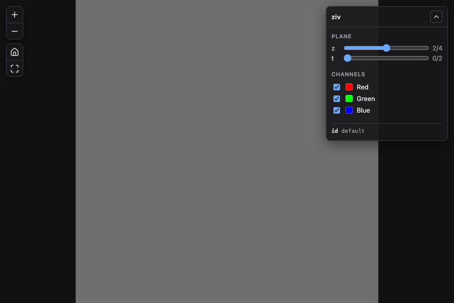

# The built-in viewer

`ziv serve` embeds an OpenSeadragon viewer at `/viewer/`, and `ziv export` writes the same viewer
into the export root, split across `index.html` and `viewer/` (`viewer.js`, `viewer.css`, and the
vendored assets). It must be served, not opened as `file://`: the viewer fetches its own
`info.json` and `ziv/views.json`, both refused at that origin. Both vendor the same OpenSeadragon
v5.0.1 build.

The live viewer additionally offers **channel toggles**, **z/t sliders** and a **label picker**,
because ziv's tile routes already accept a dynamic projection identifier — `@z=..,t=..,c=..`,
`@overlay=..`, `@label=..` — and nothing surfaced it. The controls are a thin layer over that URL
grammar: every interaction just rebuilds the identifier and reopens the tile source.



The panel sits top-right because the zoom, home and full-screen buttons are in the top-left corner,
where a panel would cover them completely.


<sub>Panel shown against IDR image 6001240 — see [`labels.md`](labels.md) for the attribution.</sub>

## How it discovers what to show

`GET /ziv/dimensions.json`:

```json
{
  "sizeT": 3, "sizeZ": 5, "sizeC": 3,
  "defaultT": 0, "defaultZ": 2,
  "channels": [
    {"index": 0, "label": "Red", "color": "FF0000",
     "window": {"start": 0.0, "end": 255.0}, "active": true}
  ],
  "labels": [
    {"name": "nuclei", "declaredColors": 61}
  ]
}
```

**Why not `info.json`.** That document is a IIIF Image API description of a 2D image, and ziv
advertises `level2` conformance verified against the official validator. Hanging ziv-specific
properties off it would let a viewer feature put that claim at risk, so this travels separately
under `/ziv/`, where nothing in the IIIF grammar can collide with it. A test asserts `info.json`
stays free of these fields.

Two details worth knowing:

- **`channels` is the RENDERABLE catalogue, not `0..sizeC`.** With no `omero` metadata the
  compositor's catalogue is capped at the first three channels, and asking for a channel outside it
  compositing nothing. Offering only what can be rendered is the difference between a control that
  works and one that silently produces black. A test renders every advertised channel to prove it.
- **`defaultT`/`defaultZ` are where the `default` projection actually renders** (the default z is
  the middle plane), so the controls open on the image already on screen instead of jumping on
  first interaction.
- **`labels` is empty for almost every image.** `declaredColors` is how many values the label's own
  `image-label` block gives a colour to; the viewer uses it to decide whether offering the
  declared-colour palette makes sense at all, since a label with an empty table renders entirely
  transparent. See [`labels.md`](labels.md).

It sits inside the auth-gated sub-router: with `ZIV_AUTH_*` configured it is protected exactly like
tiles and `info.json`.

## Behaviour

| Situation | What the viewer does |
|---|---|
| `sizeZ` or `sizeT` > 1 | Shows that slider, ranged `0..size-1`, opening at the default |
| More than one renderable channel | Shows a labelled, colour-swatched checkbox per channel |
| Single plane, single channel, no labels | Hides the panel entirely rather than showing dead controls |
| All channels re-enabled | Drops `c=` from the identifier — it matches the image's own default, and naming every channel would fragment the tile cache for nothing |
| Last visible channel | Its checkbox locks. The server renders nothing with no channel selected, which reads as a broken viewer rather than an empty selection |
| The image carries labels | Shows a **Labels** picker: `Image` plus one entry per label image |
| A label is selected | Shows **Mode** (over the image / on its own), **Colours**, and — over the image — an **Opacity** slider, opening at 60% |
| Mode is "over the image" | The channel checkboxes stay live: the base of an overlay is the ordinary image render, so they still matter |
| Mode is "on its own" | Every channel checkbox locks, with a note saying why. A mask alone has no channels to combine, and a live control that changes nothing is worse than a disabled one |
| The selected label declares no colours | The colour choice is hidden entirely — `:table` on an empty colour table renders a blank screen |
| Opacity back at 100% | Drops the opacity from the identifier, same rule as the channel toggles |
| `/ziv/dimensions.json` unavailable | Controls stay hidden; the image still loads. An older server, or one refusing the endpoint because auth is on, must not break the viewer |

Pan and zoom survive a control change: the viewport bounds are captured before the reopen and
restored after, so changing plane or channels updates the image in place.

## Navigation buttons

Zoom in, zoom out, home and full screen are drawn by `crates/viewer-assets/assets/viewer/nav/nav.js` with
[Lucide](https://lucide.dev) icons, in place of OpenSeadragon's image-sprite buttons
(`showNavigationControl: false`). The live viewer and every static export load the same file, so an
export looks like the viewer it was previewed in.

- **Same behaviour as the buttons they replace.** Each handler is the one in OpenSeadragon 5.0.1:
  multiply the zoom by `zoomPerClick` and clamp, `goHome()`, and the same full-page/full-screen
  toggle. Only the drawing changed.
- **Real `<button>` elements.** They are in the tab order, answer Enter and Space, show a focus
  ring, and carry an accessible name. The sprite buttons had none of that.
- **They do not fade.** OpenSeadragon hides its controls two seconds after the pointer leaves;
  the control panel never does, so these do not either (`autoFade: false`).
- **They survive full page.** Full page detaches everything in `<body>` outside the viewer, so the
  buttons are added as an OpenSeadragon control rather than as a sibling of it. The full-screen icon
  and label follow OpenSeadragon's `full-page` and `full-screen` events rather than the click, so
  they are also right after leaving with Escape.
- **Offline.** The icon path data is inlined, not fetched, and pinned to `lucide-static` 1.45.0.
  Lucide is ISC, and most of the icons derive from Feather (MIT); both notices are in
  `crates/viewer-assets/assets/viewer/nav/LICENSE-lucide.txt`, which ships beside `nav.js` in the binary and in every
  export.

**The panel's collapse toggle uses the same icons**, from the same file (`zivIcon`): a chevron up
to collapse and down to expand. Not minus and plus, which already mean zoom out and zoom in a few
hundred pixels away.

**The panel and the loading indicator work in full page too.** Both are moved inside the viewer's
element at startup, beside OpenSeadragon's container. They used to sit in `<body>`, so full page
hid every control and the only loading signal. They are not OpenSeadragon controls like the
buttons, because `addControl` writes `display` and `position` inline, which would override the
`[hidden]` rules they depend on and their own corner positions.

## Loading state

A cold tile from a remote OME-Zarr takes 15-25 seconds — it fetches and decodes a whole compressed
chunk per channel — and a tile that exceeds the server's request timeout previously just never
appeared. Without a signal the viewer looks broken rather than busy, and a failure is
indistinguishable from a slow success.

A status pill in the bottom-left corner (the panel is top-right, the navigation buttons top-left)
reports the state:

| State | When | What it says |
|---|---|---|
| hidden | load finished, or finished in under 300ms | nothing — an instant load must not flash a spinner |
| loading | tiles outstanding for >300ms | *Loading tiles…* |
| loading | still going after 6s | *Still loading — fetching chunks from the remote store; a cold region can take a while* |
| warn | a tile fails and is being retried | *Some tiles are slow to arrive: retrying them; the image store is responding slowly* |
| warn | a tile fails every retry | *N tiles failed to load: the image store did not answer in time, even after retrying. Try a lower zoom, or fewer channels* |
| error | the tile source will not open | the underlying message |

Two details that are less obvious than they look:

- **A freshly opened OpenSeadragon item reports `getFullyLoaded() === true`** before it has
  requested a single tile — nothing is outstanding because nothing has been asked for. Treating
  that as "done" hid the indicator for the entire initial fetch, which is the longest and most
  confusing wait there is. A load therefore only counts as finished once at least one tile has
  actually arrived.
- **Failures are reported on the FIRST one**, not when the load settles. When a whole grid is
  timing out, continuing to say "still loading" for another 30 seconds is actively misleading.
- **A failure is counted per tile, not per report.** OpenSeadragon raises `tile-load-failed` for
  every failed attempt, including the ones it is about to retry, so the viewer counts attempts per
  tile and only calls a tile failed once all of its attempts have failed. A retried tile that
  arrives clears itself from the report.

### Slow stores

Against IDR's whole-brain image (idr0048A 9846152, 19120x13350, streamed from S3 over a slow link)
the viewer reported 27 tiles failed on a single plane. Only 3 of those were failed requests. The
other 24 were OpenSeadragon's own 30-second timer, and none were retried. Three settings fix it:

| Setting | Value | Why |
|---|---|---|
| `imageLoaderLimit` | 6 | OpenSeadragon's default starts every tile request at once (29 in that case), but a browser sends at most six to one host and queues the rest. Its timer starts when OpenSeadragon asks, not when the browser sends, so queued tiles timed out without ever being sent. |
| `timeout` | 45 s | Longer than the server's own 30-second request deadline, so the server's answer, a tile or a `408`, arrives first. OpenSeadragon's timer does not cancel the request, so giving up first would also keep a connection busy for nothing. |
| `tileRetryMax` | 2 | Without it a failed tile stays missing until the image is reopened. A second attempt often succeeds, because the chunks the first attempt finished fetching are cached. |

These apply to the live viewer only. A static export's tiles are pre-rendered files, and a static
host commonly speaks HTTP/2, where a limit of six would only slow it down.

`e2e/tests/slow-store.spec.ts` covers this without a slow server, through `page.route`: one test
fails every tile's first attempt and requires it to be retried, arrive, and clear the report; the
other describes the flat fixture as an 8192x8192 image, holds every tile for 1.5 s, and requires
no more than six requests outstanding at once (it was 21 before). Both were checked to fail with
the settings removed, and the first also fails when an arrived retry does not clear the report.

Under `prefers-reduced-motion` the spinner pulses instead of rotating rather than disappearing —
"something is happening" still has to be perceivable.

## Static exports

`ziv export` embeds this same page and script, switched into a **static mode** that reads a
folder's own JSON files instead of talking to a server that isn't there.

Each Level-0 tree an export writes (the root, and one per `--planes`/`--labels` view) also writes
a whole-image file for every size its own `info.json` advertises, plus `full/max/0/default.jpg`,
the IIIF Level 0 minimum, within a whole-image size budget above which a tree serves tiles only.
See [`docs/conformance.md`](conformance.md) for what that means for a client, the budget, and when
a tree is refused outright rather than exported.

### The mode marker and the loader

`index.html` carries `<meta name="ziv-mode" content="server">`; `ziv export` rewrites
`content="server"` to `content="static"` when it writes the page
(`crates/exporter/src/viewer.rs`, whose test asserts the marker occurs exactly once in the
embedded page, so a page edit that breaks the rewrite fails the build). A short inline loader
reads that marker and picks an asset base: `/viewer/` on a server, `./viewer/` in an export
(`crates/viewer-assets/assets/viewer/index.html:19-30`). It then adds `viewer.css` and loads
`openseadragon/openseadragon.min.js`, `nav/nav.js` and `viewer.js`, in that order
(`crates/viewer-assets/assets/viewer/index.html:100-109`). `viewer.js` reads the same marker itself to decide which mode
it is in (`crates/viewer-assets/assets/viewer/viewer.js:7-8`).

### What static mode shows and hides

| | Server mode | Static mode |
|---|---|---|
| Reads | `/ziv/dimensions.json`; `/ziv/images.json` at a multi-image root | `ziv/dimensions.json` and `ziv/views.json` |
| Opens a view | builds the identifier, opens `/iiif/{identifier}/info.json` | looks up the folder in `views.json`, fetches its `info.json`, and opens it with `id` set to that folder's own URL (`viewer.js:472-492`) |
| z slider | shown whenever `sizeZ > 1` | shown only when `views.json` lists more than one plane (`viewer.js:296-297`) |
| t slider, channel toggles | shown when present | never shown (`viewer.js:298-299`) |
| Labels | Show, Mode, Colours, Opacity | Show only: Mode, Colours and Opacity stay hidden, fixed by the export (`viewer.js:265-275`) |
| Catalogue picker | offered at the root of a multi-image server | never offered: a static page always opens straight into `start()` (`viewer.js:611`) |
| No `views.json`, or one this build does not recognise | n/a | opens the root `info.json` with no controls (`viewer.js:543-548`) |

The last row is what lets any build of this viewer, past or future, open any export: `views.json`
and `dimensions.json` are written by every export, flags or not, but a viewer that does not
understand `views.json`'s `version` field, or one asked to open a folder that has no such file at
all, still shows the image, just without the controls it cannot support.

### Tile loading

Static mode keeps `tileRetryMax` but drops the other slow-store tuning above
(`imageLoaderLimit`, `timeout`): a static tile is a pre-rendered file, often served over HTTP/2,
where a limit of six requests would only slow things down (`viewer.js:51-62`).

### `ziv/views.json`

Every export writes `ziv/views.json`, the map static mode uses to turn a control state into a
folder:

```json
{
  "version": 1,
  "defaultZ": 12,
  "planes": { "0": "planes/0", "12": ".", "24": "planes/24" },
  "labels": [
    { "index": 0, "name": "nuclei", "palette": "distinct", "opacity": 0.6,
      "planes": { "0": "planes/0/labels/0", "12": "planes/12/labels/0", "24": "planes/24/labels/0" } }
  ]
}
```

(Abridged: a real export lists every exported plane, not just three.) `planes` keys are exported z
values as decimal strings; the default plane always maps to `"."`, the export root, and without
`--planes` it is the only entry. `labels` is empty without `--labels`; each entry's own `planes`
map has the same keys as the top-level one. `version` is `1`: a viewer that does not recognise it
falls back to opening the root with no controls, per the table above.

`ziv export` does not copy `PROVENANCE.md`, or any other attribution file, into the export: an
export directory holds exactly the tiles, metadata and viewer described here, nothing about where
the source data came from. Whoever publishes an export of someone else's data is the one carrying
that attribution forward; see [`labels.md`](labels.md) for what the sample data below requires.

### Worked example

Measured against a real image, `idr0047A-4496763`: yeast cells under single-molecule RNA FISH,
4 channels, 25 z-planes, one label image (cell segmentation), 2048x2048 pixels, from the
[Image Data Resource](https://idr.openmicroscopy.org/) (CC BY 4.0). It is not a repository fixture:
kept in a local `~/ziv-samples/` directory outside this repository, since it is someone else's
published research data rather than a test fixture, and downloaded with the fetch script and
attribution notes that directory's own `README.md` describes.

```sh
cargo build --release -p ziv
OUT=/tmp/ziv-yeast-planes
/usr/bin/time -p ./target/release/ziv export ~/ziv-samples/idr0047A-4496763.ome.zarr "$OUT" \
  --planes --labels
du -sh "$OUT"; find "$OUT" -name default.jpg | wc -l
```

| | |
|---|---|
| Views | 50 (25 exported planes, each with one label overlay) |
| Tile files | 1,300 (26 per view, `find … -name default.jpg \| wc -l`) |
| Wall time | 7.3s real (`/usr/bin/time -p`; ~42s user time spread across parallel tile rendering, Apple M-series) |
| Output size | 64 MiB (`du -sh`) |

`ziv export` prints the same totals before and after rendering (`ziv export: planning 50 views ×
26 tiles = 1300 tiles`, then `wrote 50 views, 1300 tile files, …`), so a fresh export of this
sample reports the numbers above without further arithmetic. Of the 26 tiles per view, 2 are the
level0 whole-image contract this document's own conformance work added: the pyramid level one step
below full resolution (`full/1024,1024/0/default.jpg`, not written before) and `full/max`, a copy
of the same bytes. Full resolution itself (2048x2048) stays reachable only tiled, at the 512px
tile size; `sizes` no longer advertises it. See [`docs/conformance.md`](conformance.md) for what
that cost across a whole export, and why.

## Verification

The endpoint's contract is covered by `crates/server/tests/viewer_dimensions.rs`, including that
every advertised channel renders and that the advertised extents match what the image routes
accept (one past each end is a 400, so a slider can never request something the server refuses).

The controls themselves were driven in a real browser. `tests/fixtures/sample_multidim.ome.zarr`
exists for this: 3 x 3 x 5 (t x c x z), every plane a FLAT value

```text
value(t, c, z) = 80 + 40*t + 15*z
```

with the three channels given pure red, green and blue over a 0-255 window. That makes the
composited output of any control state computable by hand, so a browser test samples one pixel of
the rendered canvas and knows exactly which plane and which channels produced it — rather than
merely asserting that something changed.

Results, all matching prediction:

| Controls | Identifier requested | Centre pixel |
|---|---|---|
| defaults (z=2, t=0, all channels) | `default` | `(110,110,110)` |
| z=0, t=0, all channels | `@z=0` | `(80,80,80)` |
| z=3, t=1, all channels | `@z=3,t=1` | `(165,165,165)` |
| z=4, t=2, all channels | `@z=4,t=2` | `(220,220,220)` |
| z=4, t=2, red only | `@z=4,t=2,c=0` | `(220,0,0)` |
| z=4, t=2, green+blue | `@z=4,t=2,c=1,c=2` | `(0,220,220)` |
| z=1, t=0, blue only | `@z=1,c=2` | `(0,0,95)` |

The label picker is covered the same way, against `tests/fixtures/sample_labels.ome.zarr` — a red
horizontal ramp plus a blue vertical one, under four flat mask quadrants valued 0/1/2/3 whose
declared colours are transparent, red, green and half-alpha blue. So `e2e/tests/labels.spec.ts` can
assert the exact colour at each quadrant centre rather than that a dropdown changed value, and can
show that dropping a channel changes what is under the mask without changing the mask.

Identifiers name only what DIFFERS from the image's defaults, so the starting state is the literal
`default` URL and returning to it collapses back. That keeps distinct tile-cache keys to a minimum
and keeps the readout honest — it always names the URL actually being displayed, which is what
makes it worth copying.

Also confirmed in the browser: the network requests carry those exact percent-encoded identifiers
(so the readout is not merely cosmetic); the viewport survives a reopen with zero drift; the last
channel's checkbox locks and unlocks correctly; a flat single-channel image shows no panel while
still loading tiles; and the console is clean.

**Reading pixel assertions.** OpenSeadragon requests `default.jpg`, and JPEG is lossy, so a sampled
pixel can be off by one from the exact composite — the blue-only case above reads `(0,1,94)` on the
canvas while the same tile requested as `.png` is exactly `(0,0,95)`. Treat a ±1 difference as
encoding, not as a defect; request the PNG to settle it.

These checks run in CI, in the `browser (viewer)` job, from `e2e/` — a standalone Node project
outside the cargo workspace, the same way `fuzz/` is, so a Node toolchain and a downloaded browser
are never a precondition for `cargo build` or `cargo test`.

Run them locally with:

```sh
cargo build --release -p ziv        # the config refuses, with a clear message, without this
cd e2e && npm ci && npx playwright install chromium
npx playwright test                 # or: npx playwright test --headed
```

Playwright starts and stops the two servers itself (`playwright.config.ts`), one on the
multi-dimensional fixture and one on a flat image.

### Why the tests wait the way they do

A control change queues its reopen on the next animation frame, so for a moment the *previous*
tile source is still open and still fully loaded. Waiting on "tiles loaded" alone therefore passes
on stale state — it did, on the first run, and produced three false failures. The `showing()`
helper instead requires three things to agree: the identifier readout, the tile source
OpenSeadragon actually has open, and that source being rasterised. A side effect worth having is
that every wait doubles as an assertion that the readout is not merely cosmetic.

### What they were checked against

Each test was verified to fail when the behaviour it covers is broken: moving the panel back to the
top-left fails the navigation-buttons test, removing the viewport restore fails the pan/zoom test,
and removing the last-channel lock fails that test.

The navigation buttons (`e2e/tests/navigation.spec.ts`) run every test against both the live viewer
and a real `ziv export`, served to the browser through `page.route` with no server process. Checked
the same way: turning the sprites back on fails the one-set-of-buttons test, taking the buttons out
of the tab order fails the keyboard test, dropping `autoFade: false` fails the fade test, and
syncing the full-screen icon on click instead of on OpenSeadragon's events fails both full-screen
tests, and leaving the panel and the indicator in `<body>` fails the two full-page tests in
`viewer.spec.ts`. Two did not hold up on the first attempt. The fade test read the opacity of the button
group, but OpenSeadragon fades a wrapper around it, and it never moved the pointer out of the
viewer, which is what starts the fade. The Escape test asserted only the final unpressed state,
which is also the starting state. Both are fixed, and both now fail against the breakage they
missed.

One did **not** hold up. The clean-console test was written after the favicon bug, but headless
Chromium never requests `/favicon.ico`, so deleting the `<link>` leaves it green. That property is
pinned in Rust instead (`crates/server/src/viewer.rs` asserts the page declares an inline `data:`
icon); the browser test's comment now says what it does and does not cover. It still earns its
place by catching JavaScript exceptions and failed resource loads.

Rust-side coverage remains the tripwire in `crates/server/src/viewer.rs`, now asserting that
`viewer.js` still fetches the endpoint and still builds the `z=`/`t=`/`c=` identifier parts.
